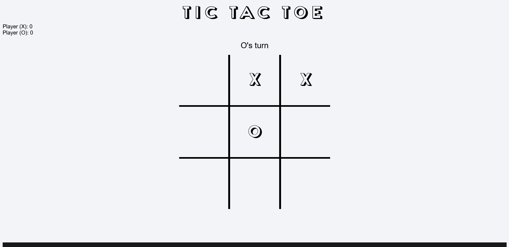

# Tic-Tac-Toe Game

This repository contains a completed implementation of the classic Tic-Tac-Toe game using HTML, CSS, and JavaScript. The game logic is organized using factory functions and follows a modular structure.

## Project Structure

The project is organized into three main components:

1. **Gameboard:**

   - The gameboard is stored as an Object inside the `Gameboard` module.
   - The `Gameboard` factory provides methods to access and manipulate the gameboard.

2. **Player:**

   - Players are represented by objects created using the `Player` factory function.
   - Each player has a name and a token ('X' or 'O').

3. **ScreenController:**
   - The `ScreenController` handles the flow of the game in the script file.
   - It includes functions to check for winners, ties, and to switch between players.

## Usage

1. **Display/DOM Logic:**

   - The gameboard array is rendered to the webpage.
   - Players can interact with the DOM elements to place marks.

2. **Player Interaction:**

   - Players can add marks by clicking on the board squares.
   - Logic prevents players from playing in occupied spots.

3. **Interface Cleanup:**
   - Players can input their names.
   - A button allows starting/restarting the game.
   - Results are displayed upon game end.

## Acknowledgments

This project was completed as part of the [Odin Project](https://www.theodinproject.com/).

[Lesson link](https://www.theodinproject.com/lessons/javascript-tic-tac-toe)

[Live Preview](https://odilson-dev.github.io/tic-tac-toe-js/)
